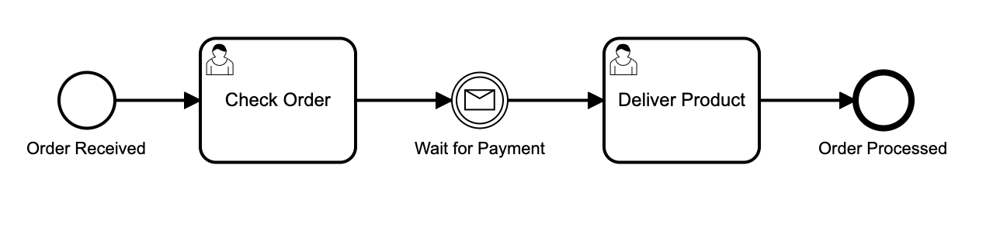

## Message Events
Message events can be used to start, interrupt or end messages. Additionally, they can used as non-interrupting events, e.g. if one of your customer requests some additional information without wanting to interrupt a process. The event always provides a name/ topic and carries a payload, basically like every simple email.

Let us consider a simple Ordering Process: 

Once an order is placed by the customer, an employee reviews the order, waits for payment to be received, and then ships the ordered product. 
So far so good, but how can we trigger the event? In production, messages come, for example, from customers in the form of emails, which are processed by components of the backend. In our case we will simulate the customer request by an API call using [Postman](https://www.postman.com/downloads/). A documentation of the Message API from Camunda can be found [here](https://docs.camunda.org/manual/7.15/reference/rest/message/post-message/)

### Set up the communication
Familiarize yourself with the [Message API](https://docs.camunda.org/manual/7.15/reference/rest/message/post-message/) and configure the Message event. You need to correlate the message to the process instance. This is done by using Correlation keys. As soon as the process engine receives the message, the content is set as process variable.
The payload of your POST-request should contain all the required information to do this. A sample payload looks like this: 
```
{
"messageName" : "yourMessageName",
"correlationKeys" : {
"customer" : {
    "value" : "yourCustomerInput", 
    "type": "String"}
},
"processVariables" : {
    "variable1" : {
        "value" : "100", 
        "type": "String"
        },
    "variable2" : {
        "value" : "credit", 
        "type": "String"
        }
}
}
```

Please create a POST-request in Postman with all required properties and make sure that the request is successfully accepted by the process engine. By fetching the process variables in the camunda web surface, you should be able to see your provided process variables.


### Add a non-interrupting message event
If a customer changes his mind and wants to cancel his order, an interrupting message event must be inserted. This cancellation process should be triggered by the customer's email, after which an employee must take care of canceling and deleting the order. 
Model this termination process as a subprocess and then create a corresponding POST. The message from the customer should include the reason for the cancellation.